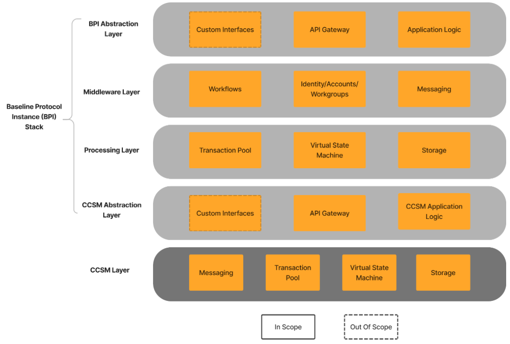

# Architecture

The Baseline Protocol provides a framework that allows Baseline Protocol Implementations (BPIs) to establish a common (business) frame of reference enabling confidential and complex (business) collaborations between enterprises without moving any sensitive data between traditional Systems of Record.

Presented below, a reference architecture that when implemented ensures that two or more systems of record can synchronize their system state over a permissionless public Consensus Controlled State Machine (CCSM) network.

## Reference Architecture Layers

A Baseline Protocol Stack Reference Architecture as depicted above in Figure 1 is comprised of the following layers:

* **Baseline Protocol (BPI) Abstraction Layer**: This layer enables accessing all externally available BPI functions through APIs as defined in the Baseline Protocol API Standards document
* **Middleware Layer**: This layer manages all counterparties to an agreement and its associated workflows and worksteps with business rules and business data as well as all counterparty delegates. In addition, it manages all messaging between counterparties to an agreement and instantiation of processing layers based on newly created or updated agreements and their workflows, worksteps, business rules, and business data.
* **Processing Layer**: Manages, properly sequences, and deterministically processes and finalizes in a privacy-preserving, cryptographically verifiable manner all state change requests from counterparties to all agreements represented in the BPI.
* **CCSM Abstraction Layer**: This layer enables accessing all required BPI functions implemented on one or more CCSMs through APIs as defined in the Baseline Protocol API Standards document.
* **CCSM Layer**: This layer manages, properly sequences, and deterministically processes in a privacy-preserving, cryptographically verifiable manner all transactions from the Processing Layer as well as either deterministically or probabilistically finalizes on the CCSM all CCSM state transitions based on said transactions.

## Components of each layer

* **BPI Abstraction layer**
  * **API Gateway**: An API gateway that exposes all required functionality to the counterparties to an agreement and enforces all necessary authentication and authorization of API calls as well as properly directs the API calls within the Baseline Protocol Stack
  * **Application**: The application logic which manages the pre-processing and routing of all API requests, as well as the enforcement of authentication and authorization protocols and rules.
* **Middleware Layer**
  * **Workflows**: A Business Process Management engine that allows for the definition, management, and instantiation of workflows and worksteps and associated business rules and data based on (commercial) agreements between counterparties
  * **Identity/Accounts/Workgroups**: A capability that allows for the identification and management of counterparties and their delegates as well as members of workflows and worksteps organized in workgroups that are derived from the counterparties to an agreement.
  * **Messaging**: A messaging capability that allows the exchange of secure and privacy-preserving messages between counterparties to an agreement to communicate and coordinate an agreement on proposed (commercial) state changes.
* **Processing Layer**
  * **Transaction Pool**: one or more transaction pools that hold, properly sequence, preprocess and batch for processing by the Virtual State Machine all requested state change transactions of a BPI.
  * **Virtual State Machine**: one or more Virtual State Machines which deterministically processes and finalizes in a privacy-preserving, cryptographically verifiable manner all state change request transactions.
  * **Storage**: A storage system for the cryptographically linked current and historical state of all (commercial) agreements in a BPI.
* **CCSM Abstraction Layer**
  * **API Gateway**: An API gateway that enables accessing all required BPI functions implemented on one or more CCSMs, and properly directs the requests within the CCSM Abstraction layer to the proper CCSM API application logic
  * **Application**: The CCSM API application logic manages the pre-processing, as well as the proper usage of the underlying CCSM and BPI authentication and authorization.
* **CCSM Layer** is comprised of
  * Messaging: A messaging capability that allows the exchange of messages between CCSM nodes that comprise either received transactions or a new proposed CCSM state.
  * Transaction Pool: A transaction pool holds, properly sequences, pre-processes, and batches for processing by the CCSM Virtual State Machine all submitted CCSM transactions.
  * Virtual State Machine: A Virtual State Machine deterministically processes in a cryptographically verifiable manner all submitted transactions for CCSM state changes.
  * Storage: A storage system for the cryptographically linked current and historical state of all CCSM State Objects.

## Glossary

If you are unsure about any specific terms feel free to check the [Glossary](glossary.md).
