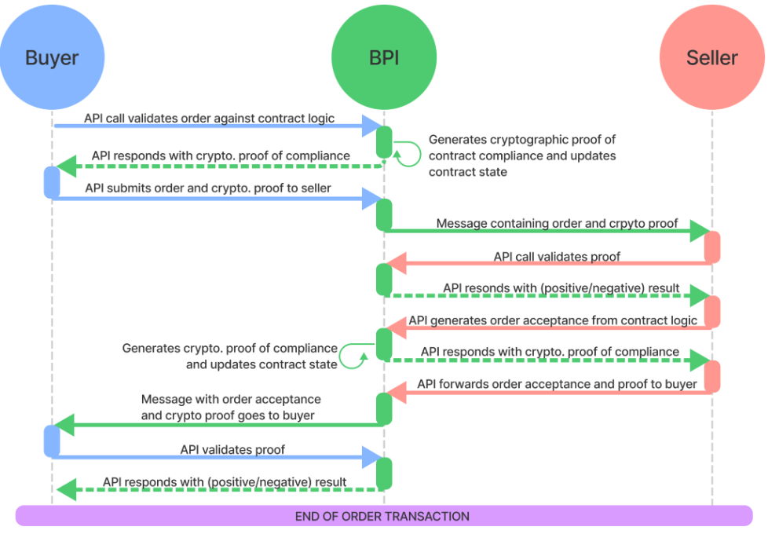

# Introduction

## What is the Baseline Protocol?

The Baseline Protocol is an open-source initiative that combines advances in cryptography, messaging, and consensus-controlled state machines -- often referred to as blockchains or distributed ledger technology (DLT) -- to deliver secure and private business processes, event ordering, data consistency, and workflow integrity at low cost. The Baseline Protocol provides a framework that allows Baseline Protocol Implementations (BPIs) to establish a common frame of reference, enabling confidential and complex (business) collaborations between enterprises without moving any sensitive data out of traditional Systems of Record. The work is governed as an [EEA Community Project](https://entethalliance.org/eeacommunityprojects/), managed by [OASIS](https://oasis-open-projects.org).

## Why _Baseline_ Different Systems of Record?

Businesses spend hundreds of millions of dollars on ERP, CRM and other internal systems of record. Failure to properly synchronize these systems between organizations causes considerable disruption and waste: disputes, lost inventory, inflated capital costs, regulatory actions, and other value leakage. To avoid these problems, systems require a common frame of reference. But only the largest high-volume partnerships can afford the capital expense involved in setting up such integrations. The baseline approach requires a common frame of reference that is always on, strongly tamper resistant and able to prevent any individual or group from taking over the system and locking companies out of valid operations. These requirements strongly suggest the use of a public blockchain or Layer-2 network anchored to a public blockchain.

Past approaches to blockchain technology have had difficulty meeting the highest standards of privacy, security and performance required by corporate IT departments. Overcoming these issues is the goal of the Baseline Protocol.

## **Illustrative High-Level Example**

An illustrative example of the use of a Baseline Protocol Implementation (BPI) is a Buyer placing an order to a Seller. Normally a Buyer system creates an Order and transmits it to the Seller system through some preestablished messaging system without providing proof that the Order created is correct or even that both parties processed and stored the message consistently. This forces the Seller and Buyer systems to validate the order, often manually. This then leads to a time-consuming and often expensive back and forth between Seller and Buyer to rectify inconsistencies.

A Master Services Agreement (MSA) between a Requester (Buyer) and a Provider (Seller) is implemented on a BPI and contains billing terms, pricing, discounts, and Seller information such as billing address, etc. Once established and agreed upon by Buyer and Seller, the BPI provides state synchronization between Buyer and Seller, since the ERP systems for Buyer and Seller can now refer to mutually agreed-upon data as a common frame of reference.

Based on this mutually agreed-upon state in the MSA, the Buyer creates an Order based on the MSA, employing a cryptographic proof that confirms not only the correct application of business logic but also the correct application of commercial data in the Order creation. This proof is submitted together with the Order through the BPI and then is validated by the Seller. If the proof is validated, the Seller accepts the proposed state change by generating its cryptographic proof, confirming its acceptance of the state change. The Seller then updates the state of the business workflow in the BPI and sends the new proof to the Buyer.

The figure below visually demonstrates high-level Buyer and Seller Order generation and acceptance assuming that an MSA between Buyer and Seller already exists and is recorded on a BPI and that the commercial state has been synchronized up to this workstep in the commercial business workflow.

_Figure 1: Illustrative Example of how the commercial state between Buyer and Seller is synchronized and an Order created._

Without a BPI, both Buyer and Seller must assume that the MSA between them and all its values are correctly represented in the other party’s respective Systems-of-Record. Hence, if an order is created based upon the MSA but does not comply with the MSA, it will likely result in extensive manual interactions between Seller and Buyer at one stage or another to resolve the problem to their mutual satisfaction.

## Glossary

If you are unsure about any specific terms feel free to check the [Glossary](glossary.md).
